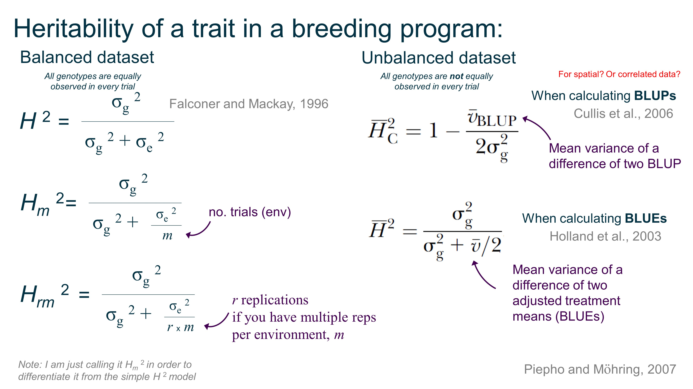

[HOME](./index.html)

# Research    

---------

[Background](./research.html)  
[Objectives](./objectives.html)  
[Resources]()  

----------

## Resources 

[Talks](./talks.html)  

**Heritability:**   
Summary of heritability equations for balanced and unbalanced datasets.   
There are more ways to calculated H2 based on if you do spatial correction, gxe, and so on, but this is a start.   
   
  
You can obtain &sigma; g 2 (genotype variance) and &sigma; e 2 (residual variance) in R using the `lme4` package with `VarCorr(model)`  after you've defined your model, but Dan Sweeney shared with me his function to calculate vBLUP:  
<pre>
  <code>
model1 <- lmer(Pheno~(1|genotypes)+Env+HD, data = EliteProgramData) 
S_1 <- as.data.frame(VarCorr(model1)); 
sigma2_g <- S_1[1,4]
sigma2_e <- S_1[2,4] #Assuming your model only has 1 random effect. If more than one, [2,4] becomes [n,4] where n = number of random effects + 1 
  
Cullis_H2=function(model){
  library(arm)
  ses<- se.ranef(model)$'genotypes' #where 'm' is your model object from 'lmer' (replace 'genotypes' with whatever you call your individuals in the data)
  v_BLUP<- ses^2
  sigma2_g=VarCorr(model, comp="Variance")$'genotypes'[1]
  Reliability<- 1- v_BLUP/ (2\*sigma2_g)  #where sigma2_g is the genetic variance estimated with the model saved in 'm'
  H2<- round(mean(Reliability),3) #This is equivalent to broad-sense heritability on the line-mean (or family-mean, if your individuals are non-inbred families) basis
  H2
}

Cullis_H2(model1)
  </code>
</pre>

**90k Illumina Array SNP Positions**

Quite often, as I read a mapping journal article, I want to know if a particular Illumina 90k marker linked to the published QTL?.  Originally I had to [blast](https://urgi.versailles.inra.fr/blast_iwgsc/blast.php) the marker one at a time against the wheat genome, but that gets tedious (and you also need to know the marker sequence, fun right). But URGI does have the SNPs aligned to the [RefSeqv1.0 JBrowse](https://urgi.versailles.inra.fr/jbrowseiwgsc/gmod_jbrowse/?data=myData%2FIWGSC_RefSeq_v1.0&loc=chr2B%3A156419001..157450000&tracks=HighConfidenceGenesv1.0%2CHighConfidenceGenes%2CINFINIUM90K_SUMMARY&highlight=). So, I downloaded the Infinium 90k track data for every chromosome and compiled them into one [90k position excel file](https://drive.google.com/open?id=1u7VcC2kejH1ky9KtPQvyc0DcTPjQI4P0) for a quick reference. Feel free to download the quick resource for easy comparison of marker with position. 

BUT, another issue I often run into is only knowing the IWB#### index number OR the marker name (ex: BobWhite_c10090_559) when I need the *other* number/name. So, here is another [90k information combined file](https://drive.google.com/open?id=1ZUgo6jHEiIrARNCUCpqLF76GA1ZS3MUM) that includes alignment of the IWB number, the marker name, flanking SNP sequences, the A allele nucleotide, the B allele nucleotide, and even the original 9k_name if appropriate. 

**The Falling Numbers** [Website](http://steberlab.org/project7599.php)   

**PHS/Dormancy Genes Positions**    
A number of genes in wheat have been cloned and characterized for PHS tolerance or grain dormancy. Since the wheat reference genome is now [publically available](https://www.wheatgenome.org/News/Latest-news/Reference-Sequence), we can [BLAST](https://urgi.versailles.inra.fr/blast_iwgsc/blast.php) the PHS gene sequences (below) against the RefSeqv1.0 alignment and identify the positions on the chromosome. Below are the estimated start and end positions based on the gene sequences available by the authors, in the publication, or public databases. The positions and links to the gene sequences may be useful to cross-reference with future PHS QTL or GWAS analyses.  

| Gene   |  | Chrm | Pos_Start    | Pos_End      | RefSeqv1.0_Gene_Name     | Reference        | Gene_Seq            |
| ------- | ------------ | ---- | ------------ | ------------ | ----------------------------------------- | ---------------------- | ------------------------------------------------------------ |
| TaSdr /    Sdr  | TaSdr-A1     | 2A   | 158,452,164  | 158,453,676  | TraesCS2A01G191400                        | [Zhang et al., 2014](https://link.springer.com/article/10.1007/s11032-013-9935-8)     | [KF021988](http://getentry.ddbj.nig.ac.jp/getentry/na/KF021988?filetype=html) |
|   | TaSdr-B1     | 2B   | 200,574,062  | 200,572,560  | TraesCS2B02G215300                        |                        | [KF021990](http://getentry.ddbj.nig.ac.jp/getentry/na/KF021990?filetype=html) |
|   | TaSdr-D1     | 2D   | 142,668,463  | 142,666,958  | TraesCS2D01G196200                        |                        | [KF021992](http://getentry.ddbj.nig.ac.jp/getentry/na/KF021992?filetype=html) |
| Tamyb10 /  R  | R-A1         | 3A   | 703,906,112  | 703,904,221  | - | [Himi et al., 2011]()      | [AB599721](https://www.ebi.ac.uk/ena/data/view/AB599721)               |
|   | R-B1         | 3B   | 757,917,663  | 757,920,399  | TraesCS3B01G515900                        |                        | [AB191459](https://www.ebi.ac.uk/ena/data/view/AB191459)                 |
|    | R-D1         | 3D   | 570,799,694  | 570,803,366  | TraesCS3D01G468400                        |                        | [AB191460](https://www.ebi.ac.uk/ena/data/view/AB191460)                 |
| TaVp-1 / Vp1      | TaVP-1A      | 3A   | 659,556,434  | 659,552,099  | TraesCS3A01G417300                        | [Yang et al., 2014](https://link.springer.com/article/10.1007%2Fs11032-013-9935-8)      | [Vp-1A](https://www.ncbi.nlm.nih.gov/gene/?term=Vp-1A) |
|   | TaVP-1B      | 3B   | 693,342,691  | 693,338,300  | TraesCS3B01G452200                        |                        | [AJ400713](http://getentry.ddbj.nig.ac.jp/getentry/na/AJ400713?filetype=html) |
|    | TaVP-1D      | 3D   | 525,473,897  | 525,469,502  | TraesCS3D01G412800                        |                        | [AJ400714](http://getentry.ddbj.nig.ac.jp/getentry/na/AJ400714?filetype=html) |
| TaPHS1 / TaMFT    | TaMFT-3A     | 3A   | 7,294,362    | 7,297,912    | TraesCS3A02G006600                        | [Nakamura et al., 2011](http://www.plantcell.org/content/23/9/3215)  | [G1UE17 ](https://www.uniprot.org/uniprot/G1UE17)                       |
| TaDOG1       | TaDOG1L4     | 3A   | 67,123,800   | 67,124,332   | TraesCS3A01G103500                        | [Ashikawa et al., 2013](http://www.sciencedirect.com/science/article/pii/S0168945213000678) | [AB555729](https://www.ebi.ac.uk/ena/data/view/AB555729)                 |
|   |              | 3B   | 91,147,446   | 91,147,986   | TraesCS3B01G120900                        |                        |                                                              |
|   |              | 3D   | 58,107,736   | 58,108,268   | TraesCS3D01G105800                        |                        |                                                              |
| TaMKK3 / Phs-1    | TaMKK3-A     | 4A   | 605,019,000 **a** | 605,023,000 | TraesCSU01G167000                         | [Torada et al., 2016](http://www.cell.com/current-biology/fulltext/S0960-9822(16)30010-0?_returnURL=http%3A%2F%2Flinkinghub.elsevier.com%2Fretrieve%2Fpii%2FS0960982216300100%3Fshowall%3Dtrue)    | [LC091368](http://getentry.ddbj.nig.ac.jp/getentry/na/LC091368?filetype=html) |
|   | TaMKK3-B     | 5B   | 710,226,100  | 710,230,860  | TraesCS5B01G565100                        |                        |                                                              |
|   | TaMKK3-D     | 5D   | 556,557,389  | 556,553,063  | TraesCS5D01G549600                        |                        | [LC091372](http://getentry.ddbj.nig.ac.jp/getentry/na/LC091372?filetype=html) |
| TaQsd1 / Qsd1 **b**    | TaA          | 5A   | 432,446,370  | 432,446,370  | TraesCS5A01G216200                        | [Onishi et al., 2017](https://doi.org/10.1186/s12864-017-3880-6)    | [Qsd1](https://static-content.springer.com/esm/art%3A10.1186%2Fs12864-017-3880-6/MediaObjects/12864_2017_3880_MOESM2_ESM.zip) |
|    | TaB          | 5B   | 387,744,682  | 387,740,080  | TraesCS5B01G214700                        |                        |                                                              |
|   | TaD          | 5D   | 332,043,225  | 332,043,225  | TraesCS5D01G224200                        |                        |                                                              |  

**a** RefSeqv1.0 maps TaMKK3-A to the unknown chrm, however based on previous research, TaMKK3-A should be between TraesCS4A01G314700 and TraesCS4A01G314800   
**b** the ortholog of the barley dormancy gene HvQsd1. The Onishi et al. 2017 study compared sequence of dormant and non-dormant lines, however further work needs to be published to see if TaQsd1 genes affect seed dormancy
